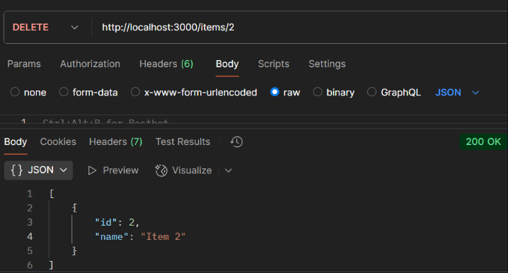
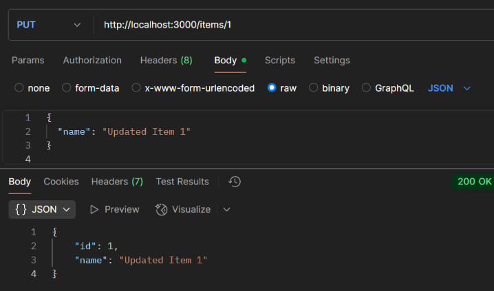
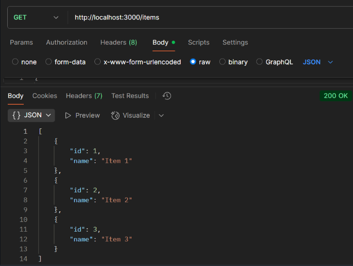
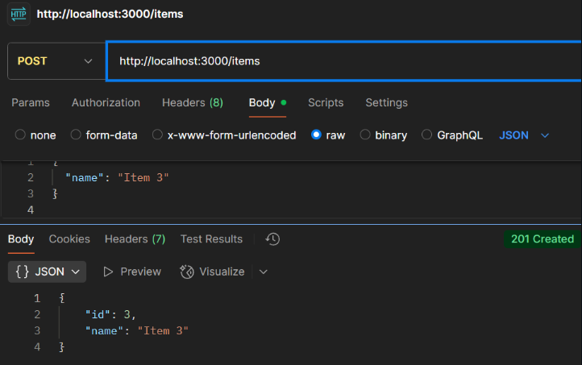

# Experiment 4: ExpressJS CRUD Routes

*Course Outcome (CO2):* Understand how to set up an ExpressJS application and create RESTful routes for GET, POST, PUT, and DELETE.

---

## Screenshots

Here’s a preview of the app:






## Objective

- Setup an ExpressJS application.
- Create routes for CRUD operations: GET, POST, PUT, DELETE.
- Test the routes using Postman.

---

## Prerequisites

- Node.js and npm installed.
- Postman installed.
- Terminal / Command Prompt / VS Code or any code editor.

---

## Step 1: Create Project Folder

```bash
cd Desktop
mkdir express-crud-app
cd express-crud-app
